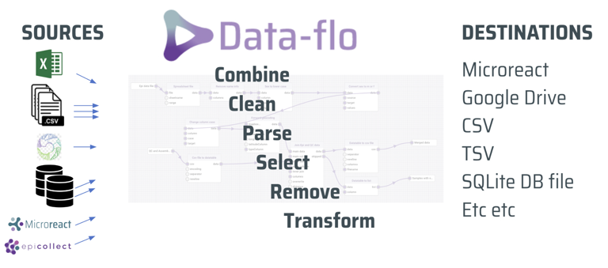
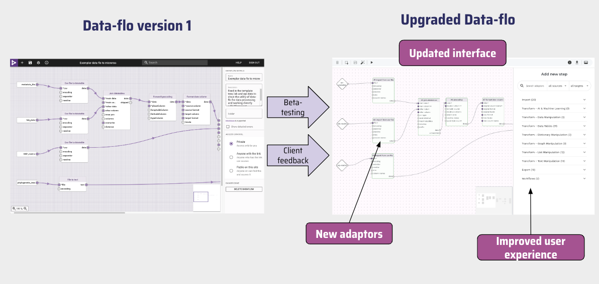

Data-flo (pronounced data-flow) is an open-source web application for data integration. It provides an easy-to-use visual interface to design reusable Workflows (data pipelines) that import, merge, clean, and manipulate data in many different ways. Once a Workflow has been created, it can be run anytime, by anyone with access, to enable push-button data extraction and transformation.

Here is a diagram of a Data-flo workflow indicating the different data sources and output destinations. 



## Why use Data-flo?

Data-flo saves you time by removing the bulk of the manual repetitive workflows that require multiple, sequential, or tedious steps, enabling you to focus on analysis and interpretation.

With Data-flo, users can:

* Rapidly prepare data for visualization, and reporting 
* Easily share processed data between teams 
* Consistently reproduce and validate data transformation procedures for updated or new datasets 
* Seamlessly integrate data from multiple databases and sources
* Automatically update a Microreact project with fresh data

While Data-flo is used across many sectors (data science, academia, public health institutions etc.), it contains a number of features tailored to manage bioinformatics-related datasets such as Newick files, tree files, etc. 

## Citation

If you use Data-flo within a publication please cite:

```
Centre for Genomic Pathogen Surveillance. 2019. Data-flo. https://data-flo.io. [Date accessed].
```
## Major Update in April 2024

Data-flo is continuously evolving as we learn from our community and adapt its features to accommodate new use cases.

In April 2024, a new version of Data-flo will be availble for testing on [https://next.data-flo.io/](https://next.data-flo.io/), the large-scale upgrade includes significant changes to the user interface, improved ability to process large datasets, additional adaptors, and enhanced sharing permissions. This cookbook is based on the version available at [https://next.data-flo.io/](https://next.data-flo.io/). 

Comparison of software interface evolution from Data-flo version 1 to the latest version of Data-flo, The image calls out changes to several user interface upgrades, new adaptors, and improved user experience. The diagram highlighting that beta-testing and client feedback have contributed to the updates made.




**Pre-release Phase: from 1 April 2024 to 30 June 2024**

* New version is made available for testing on [https://next.data-flo.io/](https://next.data-flo.io/)
* The current version remains unchanged and available on [https://data-flo.io/](https://data-flo.io/). 
* A banner is added to [https://data-flo.io/](https://data-flo.io/) to invite users to try the new version.

**Release Phase: from 1 July 2024 to 31 March 2025**

* The [new version](https://next.data-flo.io/) replaces the current version.
* Workflows on the old version are migrated to the new version. Workflows created on [https://next.data-flo.io/](https://next.data-flo.io/) will continue to be available on [https://data-flo.io/](https://data-flo.io/).
* The old version will be available to user on https://legacy.data-flo.io/ until 31 march 2025.

**Sunset Phase: from 1 April 2025 onwards**

* The old version (https://legacy.data-flo.io/) will be turned off.
