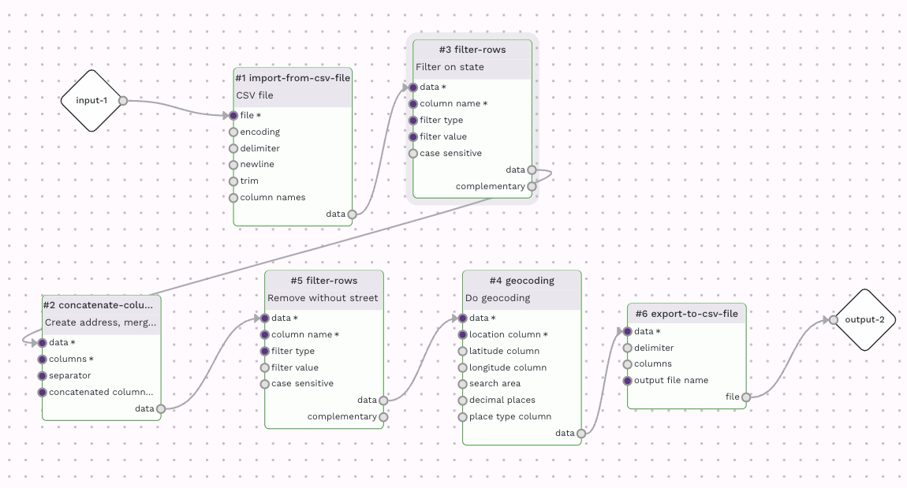
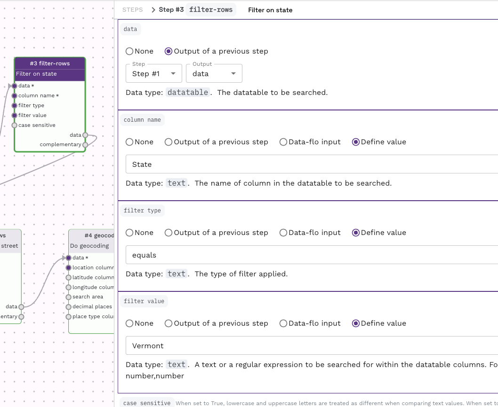
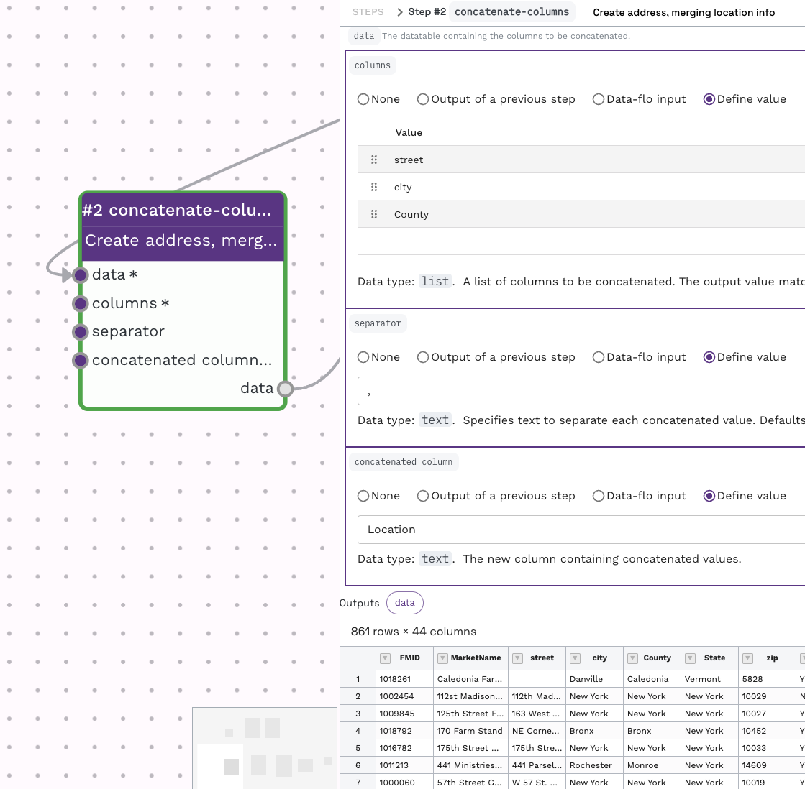
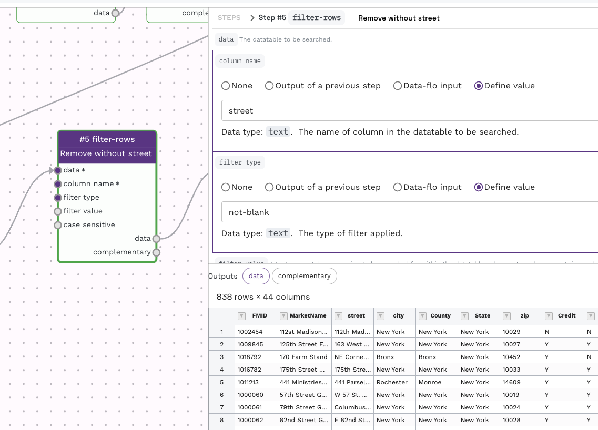
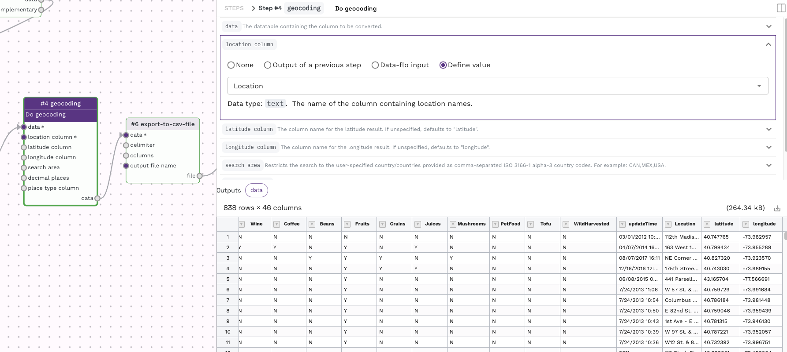
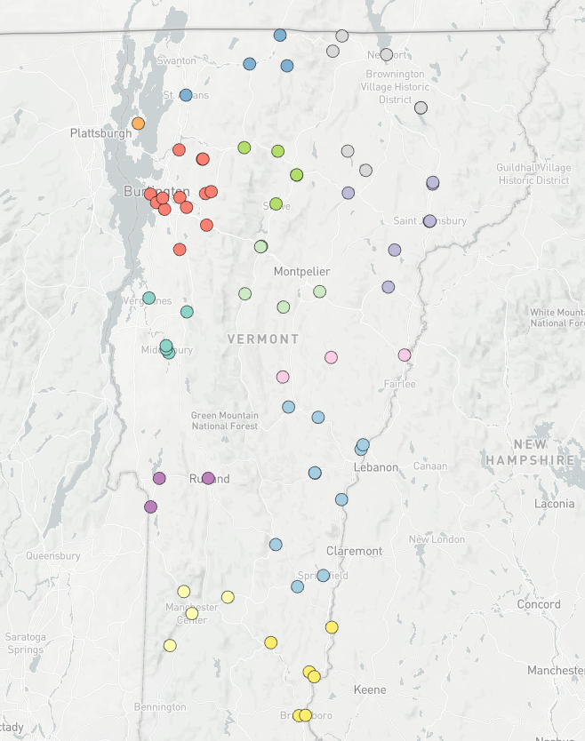

*Prepared by Nabil-Fareed Alikhan. Last updated 2024-04-09*

Converting geographic location information, like an address into a Latitute and longitude is a common hurdle for displaying data points on a map. This also effects tools like [Microreact](https://microreact.org/). Data-flo includes a geocoding adaptor that 
can solve this problem at many levels of granuality. To illustrate this, this recipe uses a dataset that has the street address of farmers markets in the United States. We will aim to filter the data and present some of these on a map.

## Data-flo features demonstrated

* Merging columns with `concatenate-columns`
* Filtering rows with `filter-rows`
* Geocoding, converting addresses into latitute and longitude with `geocoding`  

## About this dataset 

The dataset used here is not related to genomics, rather to Farmers Markets in the United States. These data are available as a [dataset on Kaggle](https://www.kaggle.com/datasets/madeleineferguson/farmers-markets-in-the-united-states). 
Farmers markets are an important way for citizens to eat healthy fresh food while supporting small family farms. This data contains information about all the registered farmers markets in the United States in 2020. This includes the city, county, lat and long, and information about the types of food sold at each market. 

You will need the following data: 

* [Data table](geocoding/farmers_markets_from_usda.csv)

## Filtering and geocoding street addresses

This can be acheived by using the following adaptors:

* `import-from-csv-file` 
* `concatenate-columns`
* `filter-rows`
* `geocoding` 
* `export-to-csv-file` 

The workflow looks like this: 



My version of [this workflow is available here](https://next.data-flo.io/run/5of1AvDj64QjP6RjFD1rsU-filter-and-geocode-example). You are more than welcome to use this workflow for other data, or clone and alter it for your own needs.

To simplify the dataset, we will focus showing farmers markets in one US state, Vermont. This is done using the `filter-rows` adaptor with the settings below. 



To create a full address line in a single column, we use the `concatenate-columns` adaptor, taking the seperate columns like "Street", "City", "County" and converting that into a single column delimted time commas. That is: 

```
Street  City    County
153 Rte 5   Hartland    Windsor
```

Is merged into:

```
Location
153 Rte 5,Hartland,Windsor
```




To make sure each market location has the same granuality, we add a filtering step with the `filter rows` adaptor to remove any rows that does not have a Street address.



!!! tip "Flexible geocoding"
    While this example uses a street addresses, the geocoding will work with less information, like with only city or country. The geocoding can also work with postcodes (e.g. CB22 3DQ) and landmarks (e.g. Big Ben)

The filtered table is passed to a `geocoding` adaptor for the actual geocoding. We previous created the "Location" field in the datatable, so we can set this as the location column for geocoding.



The output of this step is sent to a `export-to-csv-file` adaptor. This allows you to customise the final outfile, for instance, to set the output file name to be "geocoded_table.csv". The resulting file can be uploaded to [Microreact](https://microreact.org/upload) for visualisation. The final map from this example is shown below. If you are unsure how to upload data to Microreact, please [see the guide here](https://microreact-cookbook.netlify.app/basic-upload/). 


