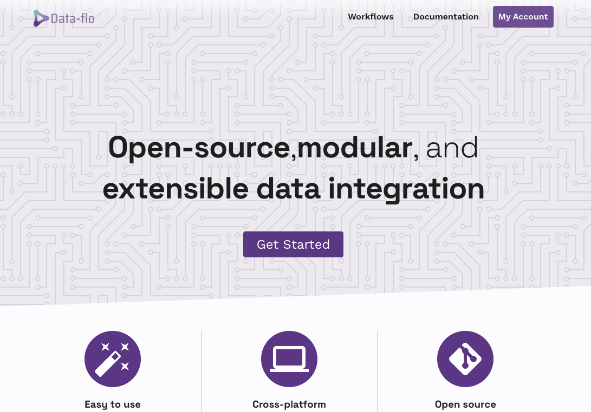
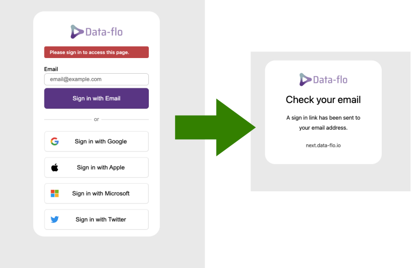
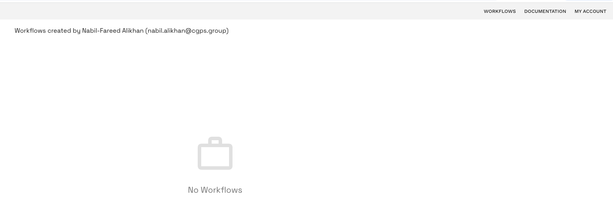
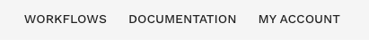
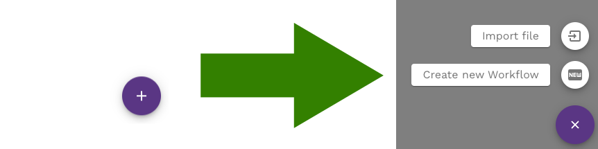
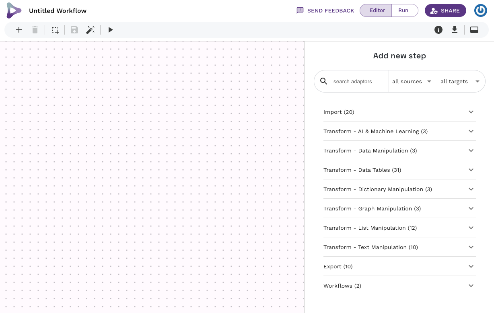

*Prepared by Nabil-Fareed Alikhan. Last updated 2024-04-08*

This recipe describes the basic process of logging in and creating a new workflow. Data-flo saves you time by removing the bulk of the manual repetitive workflows that require multiple, sequential, or tedious steps, enabling you to focus on analysis and interpretation. Armed with Data-flo, users can:

* Rapidly prepare data for visualization, and reporting 
* Easily share processed data between teams 
* Consistently reproduce and validate data transformation procedures for updated or new datasets 
* Seamlessly integrate data from multiple databases and sources
* Automatically update a Microreact project with fresh data

While Data-flo is used across many sectors (data science, academia, public health institutions etc.), it contains a number of features tailored to manage bioinformatics-related datasets such as Newick files, tree files, etc. 

## Data-flo features demonstrated

* Login and creating a new workflow

## Logging in

Nagivate to the latest version of data-flo at [https://next.data-flo.io/](https://next.data-flo.io/). You will be presented with a Splash page similar to the one below. 

Create an account by clicking the "Sign In" or "My Account" button. You can sign in either using a passwordless option where a sign-in link is sent to your email, or through one of the account options (Google, Apple, Microsoft, Twitter/X). If you use your email, be sure to check any SPAM or junk mail folders, and add data-flo.io to your safe senders list.

!!! tip
    Regardless of how you choose to login, we do not see or store your password.

If you've managed to log in sucessfully, you will be brought to the "My workflows" page. If this is your first time using data-flo, it will be blank as shown below. 

!!! note 
    See the [Data-flo manual](https://cgps.gitbook.io/data-flo/basics/account) for more information about creating an account

## Creating a new workflow

Workflows are combinations of adaptors that work together to edit, clean, merge and transform your data. To create a new workflow, click on the "Workflows" link in the top right. 

This new workflow view will show workflows you have created and other workflows that have been shared with you. The button to create a new workflow is the purple plus in the bottom right. When you click the plus you will have a choice to import or create a new workflow. Click "Create new workflow". 

You should now have a blank workflow canvas, looking similar to the one below.

!!! note 
    See the [Data-flo manual](https://cgps.gitbook.io/data-flo/basics/combining-adaptors-to-create-workflows/creating-a-workflow) for more information about creating a workflow
