*Prepared by Nabil-Fareed Alikhan. Last updated 2024-04-08*

Using Data-flo, you can make many manipulations of datatables, including merging two seperate input sources together. In this recipe, we will explictly show how to join two Excel sheets using a shared column, but this approach applies to any datatable that can be loaded into Data-flo. This recipe is serving a dual purpose of being an introduction to Data-flo in general, as such, it will be a detailed step-by-step walkthrough. 

## Data-flo features demonstrated

* Creating a workflow 
* Using File and Text inputs
* Connecting adaptors
* Customising descriptions and names
* Creating output
* Testing work flows
* `join-datatables` adaptor
* `export-to-csv-file` adaptor
* `import-from-excel-file` adaptor

## About this dataset 

To illustrate these aspects of Microreact, we will use the dataset described in Alikhan et al. (2022)[^1]. This study look at non-typhoidal *Salmonella enterica*, which can be from contaminated poultry meat, and causes diarrhoeal disease. This study examines 183 Brazilian chicken and 357 UK-imported poultry product genomes. 

In this publication, the contextual metadata, such as sample collection location and time, and the genome assembly metrics are split across two different Excel files. We want to merge these two files into a single table. 

For this exercise you will require the following files:

* [Link to sample metadata table](join-table/sample-in-this-study.xlsx)
* [Link to genome assembly metrics table](join-table/assembly-metrics.xlsx)

## Merging the two files together with an existing workflow

Start by downloading the two Excel files from the links above. If we inspect both files (using Excel), we will see that the column "ID" is the column with the sample ID and is shared between the two.

You can use [my existing workflow available here](https://next.data-flo.io/run/49tnFhRxfSi6U9kSzok2Th-merging-two-excel-sheets-on-a-shared-column). You will need to be logged in to use it.

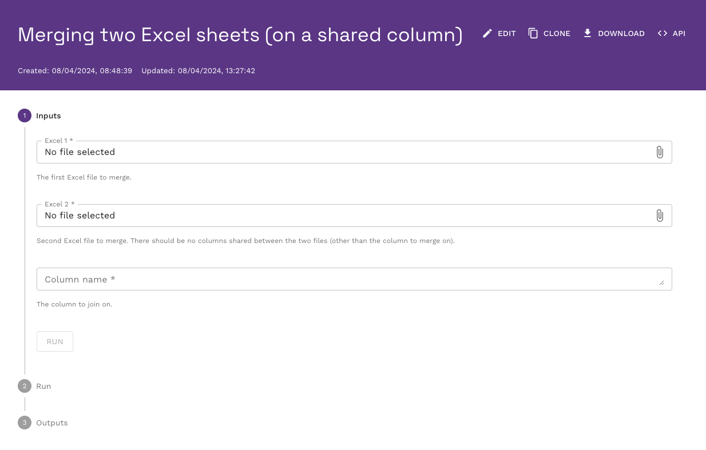

To use it, click on each of the input file fields and use to file browser window to upload the first file (sample-in-this-study.xlsx) to Excel 1, and the second file (assembly-metrics.xlsx) to Excel 2. We know that the "ID" column is the one shared between the two files, so enter this as the input for column name. 

!!! warning
    In this workflow, the column name is case-sensitive. So the input must be "ID" not "id" or "Id". 

Your input window should look something like this: 

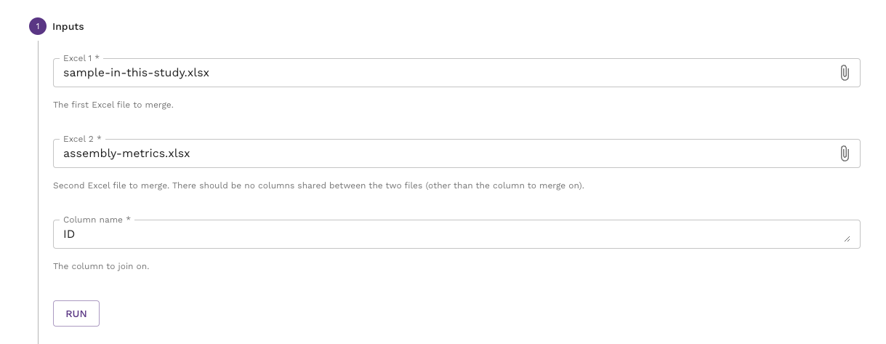

If this is the case, then click "RUN". It will take a few seconds for the workflow to run, if you are successful you will see contents of the resulting comma delimited file (csv). You can download the file with the download link on the right. 

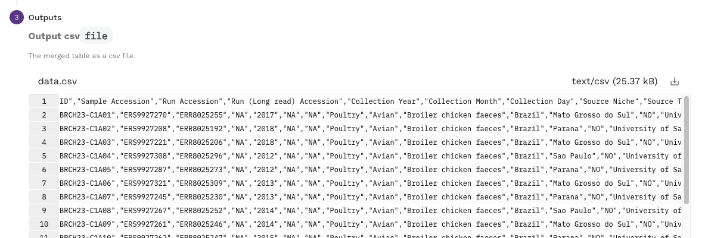

If you were unsuccessful, you will see an empty output. 

In either case, you can re-run the workflow by clicking the RUN AGAIN button. 

!!! tip 
    You are more than welcome to use this workflow for other data, or clone and alter it for your own needs. 

This is a very simple manipulation shown here in isolation. This step can be one of many other steps in a single workflow. For simplicity in this example, we have manually uploaded the input files but there are many possible input sources in Data-flo. These include (but are not limited to) other file formats like JSON or csv; online locations like Google sheets, Google drive, and Dropbox; and direct connections to databases.

## Creating the workflow 

If the existing workflow above meets your needs, then by all means clone it and keep a copy for yourself. However, you may be interested in making your own workflow specific to your use-case. It is here where I will outline the steps taken to make the workflow above. You should be able to create a new blank workflow for this recipe. If you are unsure how to do that please complete prerequisit recipe: [Login and create a new workflow](./login-workflow.md). We are aiming to make a workflow like the one below. 

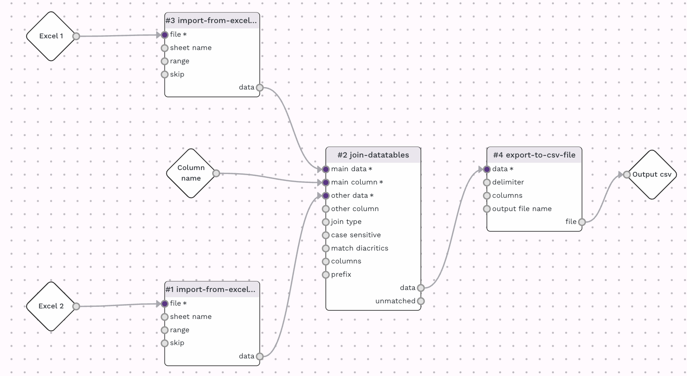

Starting with a new and blank workflow, add the `import-from-excel-file` adaptor. If you are unsure how to do this you can clear the add step button in the top left menu, or clear the add new step link on the right, as show below. 

From the adaptor menu, which shows up on the right be default, look for the `import-from-excel-file` adaptor which is under the "Import" subheading. The search bar can also help filter through the adaptors, use search terms such as "excel" or "import". Either you should be able to find the `import-from-excel-file` adaptor in the list. 

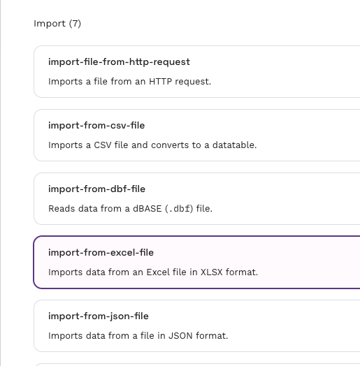

Now click on it to add it to the workflow canvas. By clicking on the header of the adaptor, the adaptor search will be replaced with a panel detailing the settings for the adaptor, as shown below. 

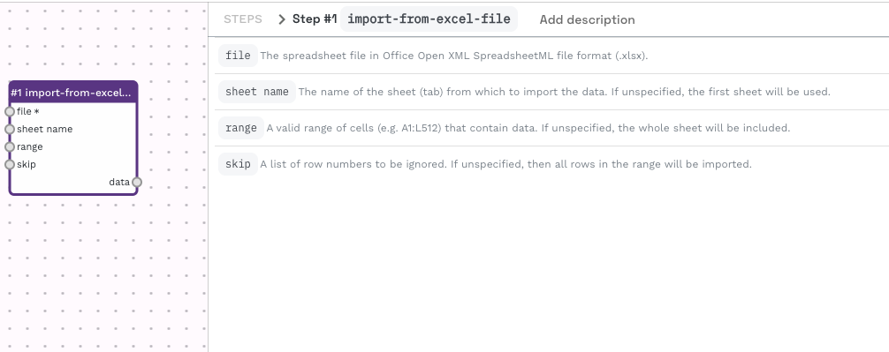

Open the section for "file" input, and set the input to "data-flo input" and in the dataflo input dropdown, select "Create new input". It should look something like the image below. 

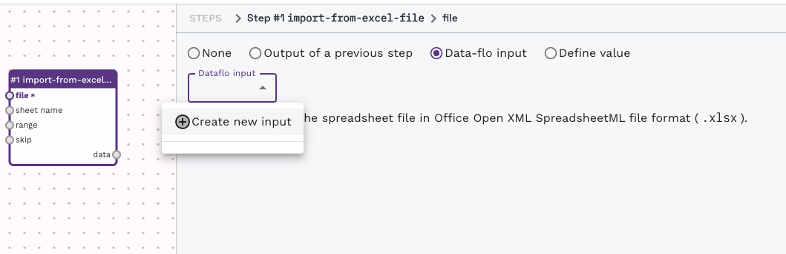

There will be a new item on the canvas added, called Input-1. We can customise it by clicking on it and changing the settings. 

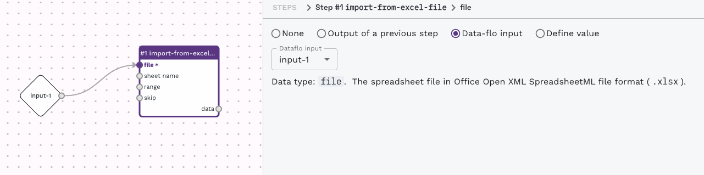

Try changing the settings. Change the input name and the description. These values will be reflected in the form presented to a user, i.e. the thing we interacted with in the previous section. You can also upload test data to help you test the workflow while you are working on it. Use our example data, "[sample-in-this-study.xlsx](join-table/sample-in-this-study.xlsx)". 

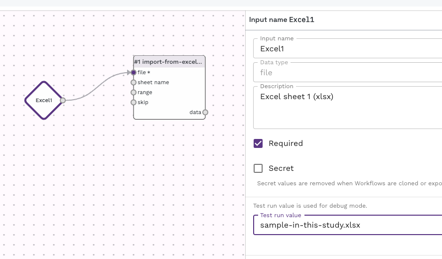

We now have an input step for the first Excel file and we need to repeat the entire process of adding and configuring an `import-from-excel-file` adaptor for the second file. Repeat the previous few steps and create another `import-from-excel-file` adaptor. Be sure to have different dataflo inputs for each `import-from-excel-file` adaptor. You canvas should look like the one below. 

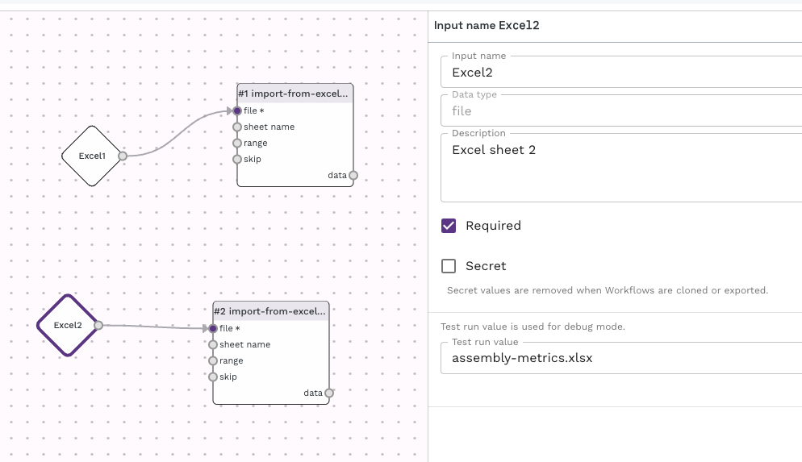

Let's add an adaptor to merge the two tables, this is called `join-datatables`. Locate and add this to the canvas.

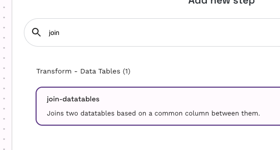

For the "main column" setting, set the input to be another new input. This will be the field where a user can enter the column name on which to join the two columns. You can configure the input as we did for the others. 

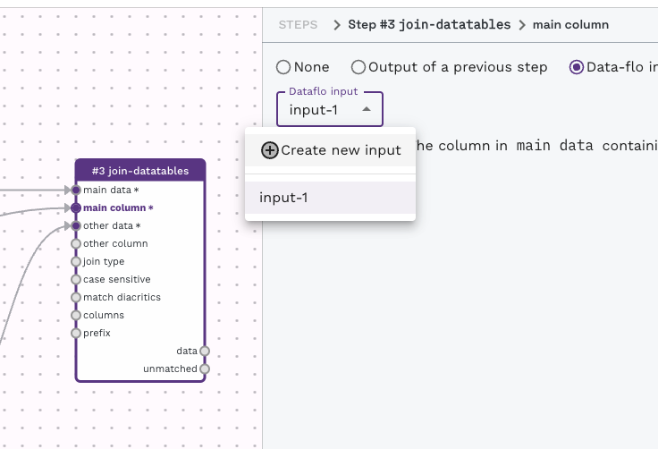

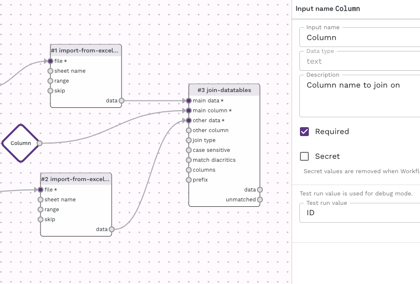

If you haven't already, join the `join-datatables` to the `import-from-excel-file` adaptors. To do this, click on the output items (right hand side items) of an adaptor and you will see a number of inputs  (left hand side) for other adaptors highlighted with a (+) plus. By clicking on the plus, you can connect the two adaptors from one to the other. If you make a mistake and want to break a connection, mouse over an existing connection (the middle of the line/arrow) and an X will appear. Clicking on this will break the connection. 

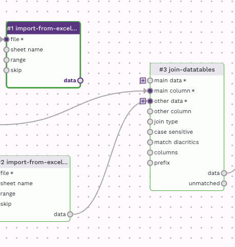

The canvas should now look like this, with three inputs, two `import-from-excel-file` adaptors, connecting into one `join-datatables` adaptor. 

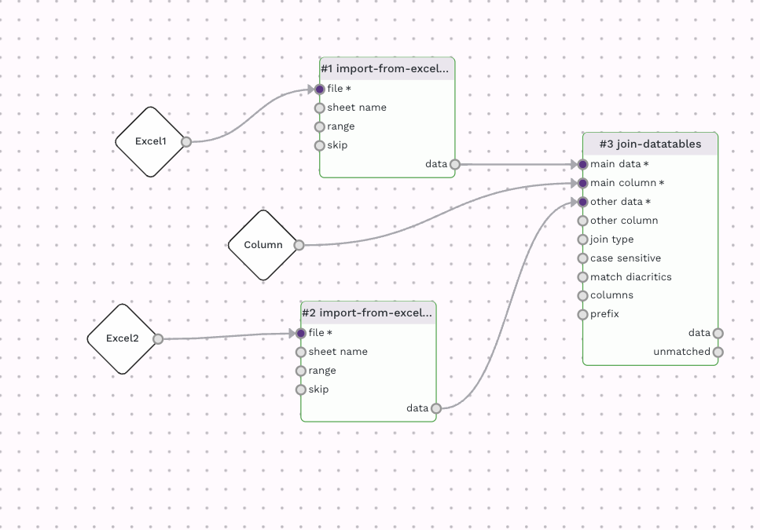

If you have added the sample data as test data into the wokrflow, you can press the "run" button (play icon) in the top left menu and see the output in the "data" output item of the `join-datatables` adaptor.  

The last stage is to add an adaptor to create an output file. We will use the `export-to-csv-file` adaptor, which can be added in the same way as the others. 

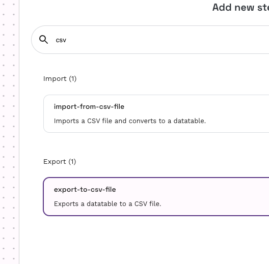

For the `export-to-csv-file` adaptor, set the file output to "Use as workflow output" as shown below. This will create an output item, which you can customise just like the input ones. Connet the `export-to-csv-file` adaptor to the `join-datatables` adaptor. 

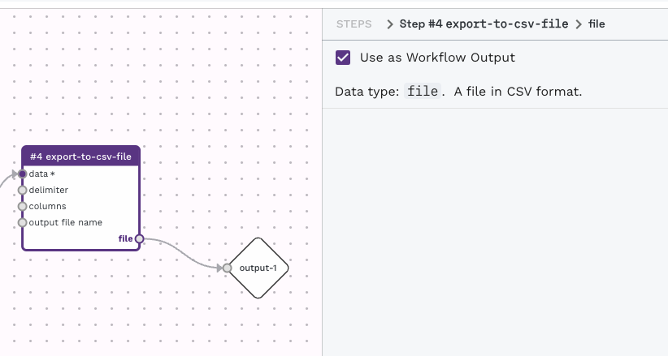

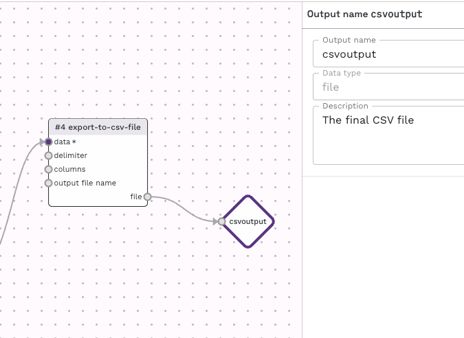

The final results will appear under "file" of the `export-to-csv-file` adaptor. 

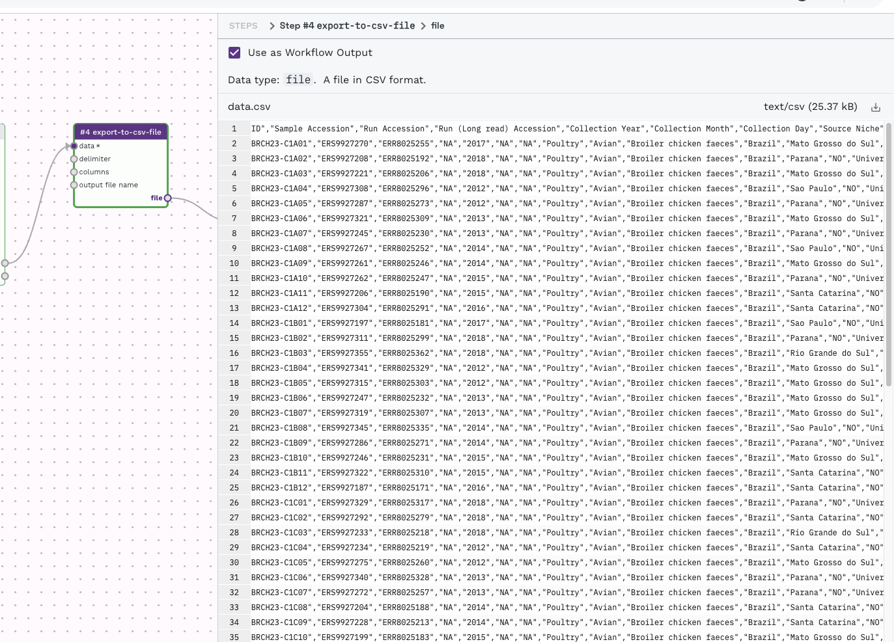

And that's it! By working through this recipe you have covered the basic functionality of data-flo. The workflow has been automatically saving as we have been working but you can explictly save it with the save icon in the top left menu, if it isn't greyed out. 

Clicking on the "Run" option in the top right, will take you to the interactive form similar to what we used in the previous section. If you would like to share this workflow, the share button in the top right will allow you to customise the sharing options to your liking and give you a link that you can share with your colleagues. 

[^1]: Alikhan NF, Moreno LZ, Castellanos LR, Chattaway MA, McLauchlin J, et al. (2022) Dynamics of Salmonella enterica and antimicrobial resistance in the Brazilian poultry industry and global impacts on public health. PLOS Genetics 18(6): e1010174. https://doi.org/10.1371/journal.pgen.1010174