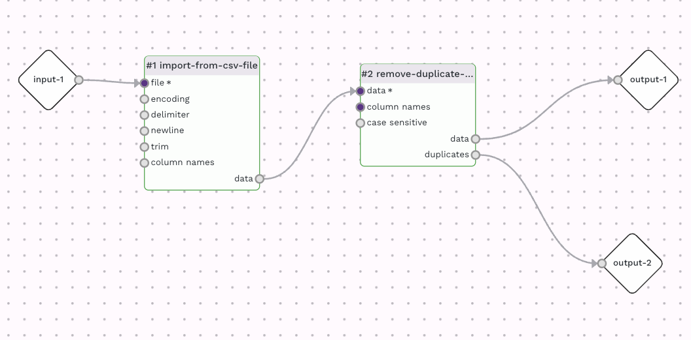
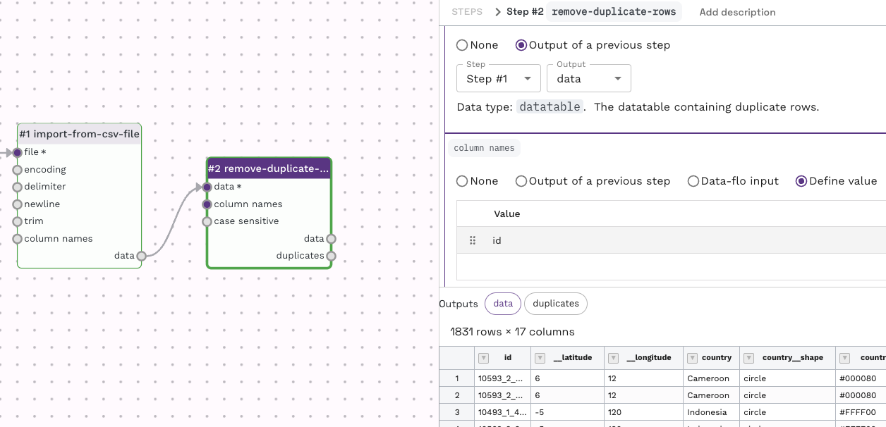
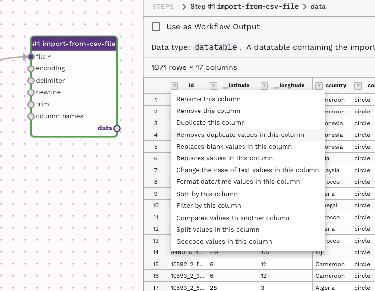
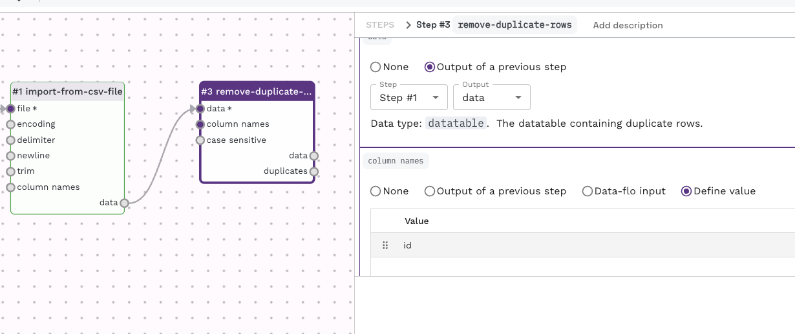
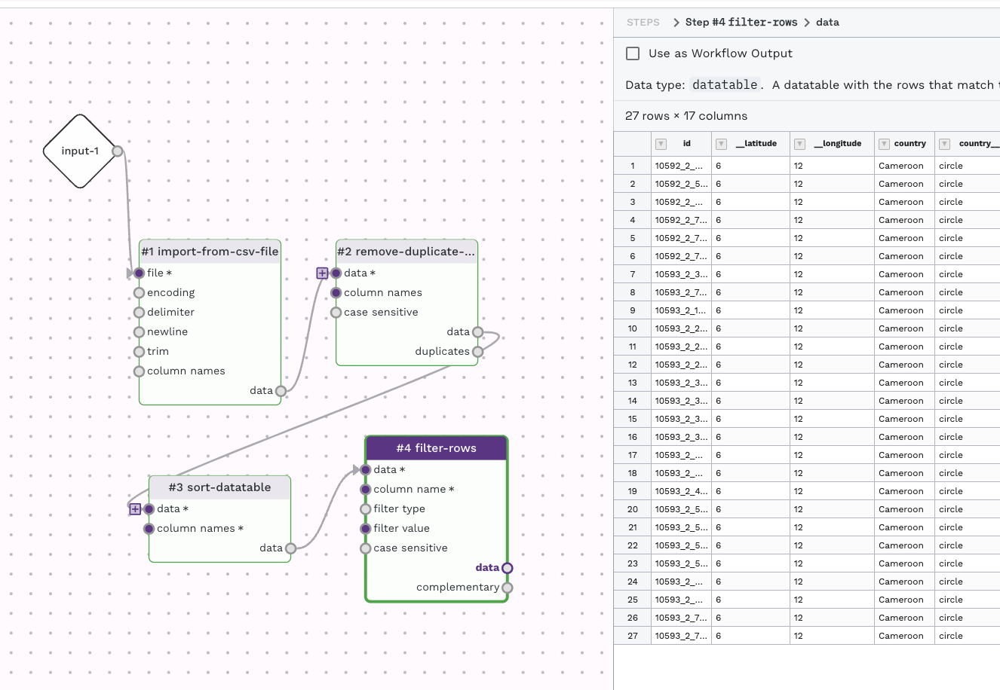

*Prepared by Nabil-Fareed Alikhan. Last updated 2024-04-08*

This recipe will show how to use the `remove-duplicate-rows` adaptor to filter duplicate rows in a datatable. 

## Data-flo features demonstrated

* `import-from-csv-file` adaptor
* `remove-duplicate-rows` adaptor
* Interative table filtering options

## About this dataset 

The data used here was originally presented in Wong et al (2015)[^1]. The study is about the genome sequencing of 1,832 *Salmonella enterica* ser. Typhi, which revealed a dominant MDR lineage, H58, spreading across Asia and Africa over three decades. H58 displaces sensitive strains, with complex MDR elements on plasmids or chromosomes. 

I have taken their sample data sheet, which had no errors, and manually added in some duplicates for the sake of this recipe. The modified file is available below:

* [Link to data table](duplicates/Wongetal-with-duplicates.csv)

## Removing duplicates

You should be able to create a new blank workflow for this recipe. If you are unsure how to do that please complete prerequisite recipe: [Login and create a new workflow](./login-workflow.md). Adding and connecting adaptors was explained in detail in the [merging two Excel sheets](./merging-two-sheets.md) recipe. If you are comfortable with the content presented in both examples, then let's continue. 

A workflow for removing duplicate rows can be done by using an Import adaptor, such as `import-from-csv-file` adaptor connected to the `remove-duplicate-rows` adaptor. A full description of the `remove-duplicate-rows` adaptor [can be found here](https://cgps.gitbook.io/data-flo/reference-guide/remove-duplicate-rows). By default the `remove-duplicate-rows` adaptor will use the entire row for comparison when looking for duplicate. You can specify a specific column (or columns) to be used under the column setting. In this case, the column "id" holds the sample Id, which should be unique, and is a good option in this case. The `remove-duplicate-rows` adaptor has two outputs, one of the deduplicated rows and another of the duplicated rows. You can use redirect the duplicated rows else, or use it as an output for logging purposes. By the way, the `remove-duplicate-rows` adaptor will retain the first instance out of the duplicate rows.

Try upload the [data table](duplicates/Wongetal-with-duplicates.csv) to the "test run value" found under the "Input" item, and then performing a test run (by using the play button in the top left menu). This will allow you to see the outcome of this adaptor while working on the workflow. You can see the specific output by clicking on either "data" or "duplicates". 

## An interactive approach

There is an interactive approach which allows you to review results and quickly chain adaptors for your workflow. Try upload the [data table](duplicates/Wongetal-with-duplicates.csv) to the "test run value" found under the "Input" item, and then performing a test run (by using the play button in the top left menu). This will allow you to see the outcome of this adaptor while working on the workflow. You can see the specific output by clicking on either "data" or "duplicates". 

By clicking the down arrow near the column name for any of the output previews, you can choose an step to apply to the data table.

This will automatically create a new adaptor, such as `remove-duplicate-rows`, to perform the task. It will prepopulate the adaptor with some information. In this case, from the output of the `import-from-csv-file` on the Id column, I selected the option to remove duplicates on that column, so data-flo automatically added and attached a `remove-duplicate-rows` with the "id" column prefilled as the column name on which to check for duplicates. 

This can be done as many times as you like, by the following set of steps: 

* Run the "test run"
* Look at the output from next output item 
* Choose a process you would like to apply 
* Repeat (i.e re-run "test run"...)

Try chaining multiple steps using this process to create a multi-step workflow like below.

For any of the output items you could like to save, check the option "Use as Workflow Output" to have the output presented when running the workflow. 

[^1]: Wong VK, Baker S, Pickard DJ, Parkhill J, Page AJ, Feasey NA, Kingsley RA, Thomson NR, Keane JA, Weill FX, Edwards DJ, Hawkey J, Harris SR, Mather AE, Cain AK, Hadfield J, Hart PJ, Thieu NT, Klemm EJ, Glinos DA, Breiman RF, Watson CH, Kariuki S, Gordon MA, Heyderman RS, Okoro C, Jacobs J, Lunguya O, Edmunds WJ, Msefula C, Chabalgoity JA, Kama M, Jenkins K, Dutta S, Marks F, Campos J, Thompson C, Obaro S, MacLennan CA, Dolecek C, Keddy KH, Smith AM, Parry CM, Karkey A, Mulholland EK, Campbell JI, Dongol S, Basnyat B, Dufour M, Bandaranayake D, Naseri TT, Singh SP, Hatta M, Newton P, Onsare RS, Isaia L, Dance D, Davong V, Thwaites G, Wijedoru L, Crump JA, De Pinna E, Nair S, Nilles EJ, Thanh DP, Turner P, Soeng S, Valcanis M, Powling J, Dimovski K, Hogg G, Farrar J, Holt KE, Dougan G. Phylogeographical analysis of the dominant multidrug-resistant H58 clade of Salmonella Typhi identifies inter- and intracontinental transmission events. Nat Genet. 2015 Jun;47(6):632-9. doi: 10.1038/ng.3281. Epub 2015 May 11. PMID: 25961941; PMCID: PMC4921243.