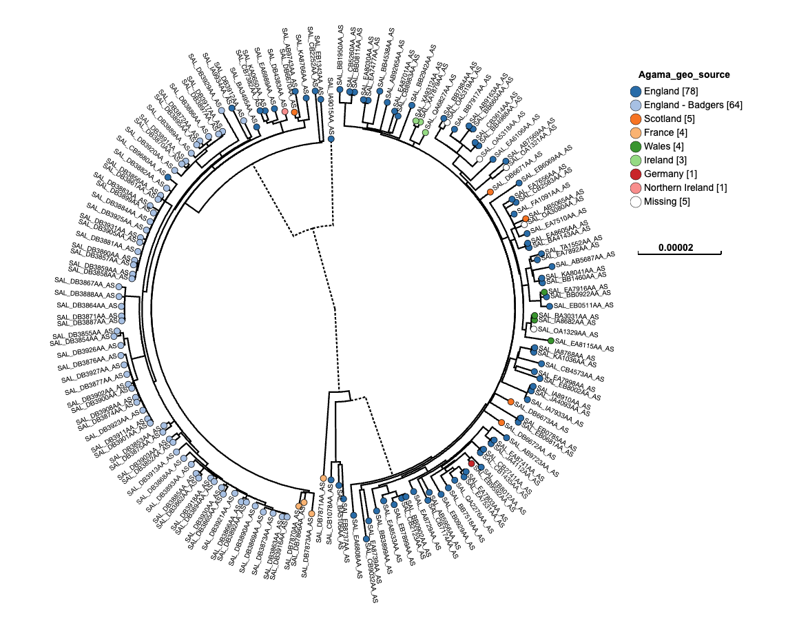
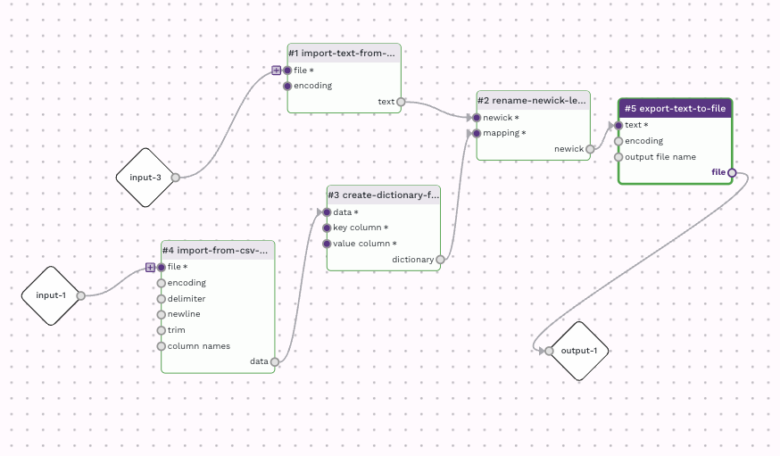

*Prepared by Nabil-Fareed Alikhan. Last updated 2024-04-09*

A Newick tree is a common way to represent phlogenetic trees. Newick files can be processed by Data-flo and be tranformed in the same way as many other data. In this specific recipe we will show a solution to a common problem of 
renaming the tip labels of a tree. The intial tree was generated while we were using has an internal ID (`SAL_`) from Enterobase, but we want to change these labels to the SRA accession, which is the final accession code from the 
public databases where we have deposited our sequencing data. You can see the initial tree below with the `SAL_` as labels. 



The Newick data format is text but can be difficult to understand and parse, as shown below. Data-flo has a specific adaptor, `rename-newick-leaf-labels` that can help.

```
((SAL_IA9015AA_AS:0.00016804,((SAL_EB1343AA_AS:9.3034e-06,SAL_CB2252AA_AS:1.13873e-05)1:2.90208e-07,
((SAL_KA8766AA_AS:4.43003e-06,(SAL_AB9743AA_AS:5.53755e-06,SAL_DB6670AA_AS:6.64654e-07)1:8.8599e-07)
1:1.77201e-06,(((SAL_DB4383AA_AS:1.32901e-06,(SAL_EA6989AA_AS:1.9935e-06,
(SAL_KA0650AA_AS:1.55053e-06,SAL_CB7382AA_AS:1.99349e-06)1:6.64491e-07)1:6.64487e-07)1:2.658e-06,
(SAL_BA3495AA_AS:1.55066e-06,(((SAL_DB3912AA_AS:3.54407e-06,SAL_IA9934AA_AS:7.53117e-06)1:4.42923e-07,
(SAL_DB3929AA_AS:7.53108e-06,((((SAL_DB3917AA_AS:1e-09, ...
```

## Data-flo features demonstrated

* `rename-newick-leaf-labels` adaptor.


!!! note "What is a Newick file?"
    A Newick file is a text-based format used to represent phylogenetic trees, which depict evolutionary relationships between biological entities such as species, genes, or sequences. In a Newick file, the tree is represented as a nested set of parentheses and commas, with each node (representing a taxonomic group or ancestral lineage) labeled with its corresponding name or identifier. The format allows for the representation of hierarchical relationships and branch lengths, making it widely used in bioinformatics and evolutionary biology for storing and exchanging tree data.

## About this dataset 

This dataset is from Zhou et al (2018)[^1]. The particular study mentioned in the paper looked at *Salmonella enterica* ser. Agama in badgers (2006–2007, Woodchester Park, England). We sequenced 72 isolates, analyzing population structure in a single host species over a small area and comparing genomes across hosts and locations. The tree used here is a preliminary tree that has an old set of IDs we wish to change. The mapping of old label to new label is available in the mapping table file below. 

For this recipe you will need the following: 

* [Original tree file (newick)](rename-newick/phylo_tree.nwk)
* [Mapping table](rename-newick/rename_mapping.csv)

## Renaming tip labels 
This can be acheived by using the following adaptors:

* `rename-newick-leaf-labels`
* `import-text-from-file`
* `import-from-csv-file` 
* `create-dictionary-from-datatable`
* `rename-newick-leaf-labels`
* `export-text-to-file` 

The workflow looks like this: 



My version of [this workflow is available here](https://next.data-flo.io/run/d5V5Uk4HwyM8LvFJDo5dDo-rename-newick-example). You are more than welcome to use this workflow for other data, or clone and alter it for your own needs. 

I started with the `rename-newick-leaf-labels` adaptor and worked backwards to make sure it had the right input. The "newick" input `rename-newick-leaf-labels` requires a Newick file, which is ultimately a text file, so to have an
import route, I used the `import-text-from-file` adaptor. The "mapping" input `rename-newick-leaf-labels` requires a dictionary. To create the dictionary, I used the `create-dictionary-from-datatable` from datatable adaptor; specifying which columns in the input mapping table would be the key and the value, Label and Rename respectively. These values are hard-coded using the "Define value" option for both "key column" and "value column" inputs in `create-dictionary-from-datatable`. To import the mapping table I used the  `import-from-csv-file` as the mapping table, in this case, is a csv file. 

The resulting Newick file from `rename-newick-leaf-labels` was directed to a final adaptor, `export-text-to-file`. This allowed me to customise the final outfile, for instance, to set the output file name to be "renamed_newick.nwk" so it would have the correct file extension for most tree visualisation programs. 

Here is the [final newick file](rename-newick/file.nwk). You will see that the "SAL_xxx" labels have been replaced, where possible, with the final SRA accession. 
If there is no mapping provided, the tip label will be left unaltered. For instance, "SAL_DB7870AA_AS" does not have an SRA accession in the mapping file, and has been left alone in the final output.

```
((SRR1966467:0.00016804,((SRR7866992:9.3034e-06,SRR7457149:1.13873e-05)1:2.90208e-07,((SRR3286948:4.43003e-06,
(SRR7192177:5.53755e-06,ERR3285039:6.64654e-07)1:8.8599e-07)1:1.77201e-06,(((ERR3285354:1.32901e-06,
.....
((SAL_DB7870AA_AS:2.65844e-06,SAL_DB7866AA_AS:1.55087e-06)1:2.2152e-07,SAL_DB7873AA_AS:4.20876e-06)1:4.4302e-07)1:1e-09)1:4.05628e-06)1:8.43982e-05)1:0.000219831,
....
```


[^1]: Zhou Z, Alikhan NF, Mohamed K, Fan Y; Agama Study Group; Achtman M. The EnteroBase user's guide, with case studies on Salmonella transmissions, Yersinia pestis phylogeny, and Escherichia core genomic diversity. Genome Res. 2020 Jan;30(1):138-152. doi: 10.1101/gr.251678.119. Epub 2019 Dec 6. PMID: 31809257; PMCID: PMC6961584.